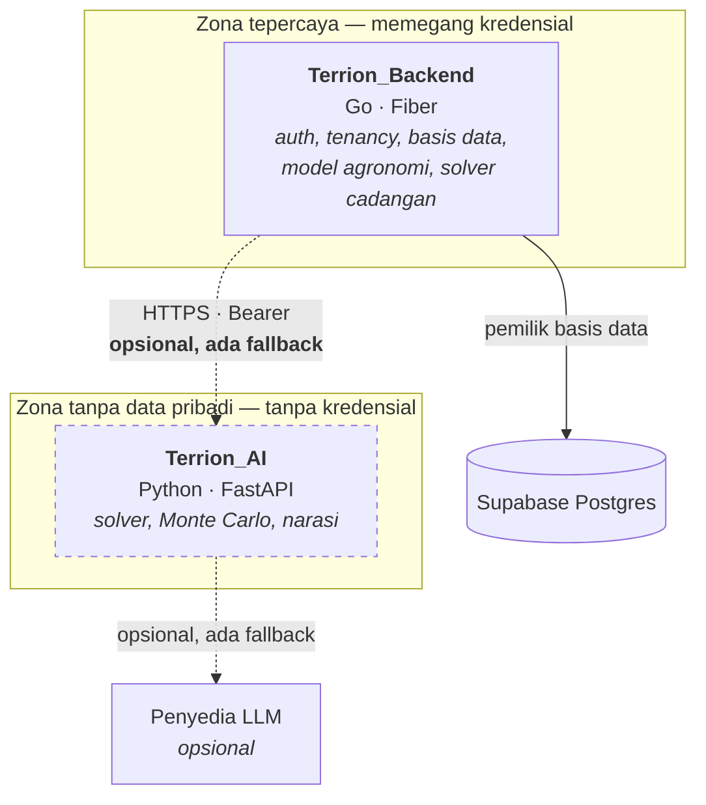

# Terrion_AI

Layanan komputasi perencanaan tanam untuk **Terrion** — sistem pelacakan lahan
dan perencanaan musim untuk koperasi tani. Repo ini menyelesaikan soal
optimasinya, mengukur risikonya, dan menjelaskannya dalam bahasa Indonesia.

> **Layanan ini opsional.** Kalau ia mati, tidak ter-deploy, atau tidak pernah
> dipanggil, fitur perencanaan di Terrion tetap berjalan penuh memakai solver
> di dalam `Terrion_Backend`. Yang berubah hanya satu field di respons:
> `"engine": "fallback"`. Itu bukan kebetulan — itu tujuan desain nomor satu.

---

## 1. Penjelasan aplikasi

Sebuah koperasi dengan 40 lahan hampir selalu menanam pada waktu yang
berdekatan, karena hujan datang bersamaan dan tetangga menanam bersamaan. Tiga
bulan kemudian seluruh lahan panen di minggu yang sama: gudang tidak muat,
truk tidak cukup, dan harga jatuh persis ketika semua orang punya paling banyak
untuk dijual.

Terrion memandang keempat puluh lahan itu sekaligus. `Terrion_Backend` (Go)
menghitung, untuk setiap kombinasi *lahan × varietas × tanggal tanam*, kapan
panennya jatuh dan berapa perkiraan tonasenya. Layanan ini menerima ratusan
kombinasi itu dan menjawab satu pertanyaan: **kombinasi mana yang sebaiknya
dipilih.**



Garis putus-putus adalah bagian yang boleh mati tanpa fitur ikut mati.

**Yang layanan ini tidak punya, dan tidak boleh punya:** koneksi basis data,
kredensial Supabase, nama anggota, koordinat lahan, nama desa, model agronomi,
dan state antar permintaan.

---

## 2. Fitur utama

| Fitur | Penjelasan |
| --- | --- |
| **Tiga rencana, tiga pertanyaan berbeda** | *Aman* menjawab "kalau cuaca membuat semua panen jatuh bersamaan, apa kita masih sanggup?"; *Pendapatan* menjawab "apa yang paling bernilai?"; *Pasar* menjawab "apa yang memenuhi kontrak yang sudah ada?" |
| **Rencana "Aman" diskor pada batas atas** | Bukan pada nilai harapan. Rencana yang hanya aman di musim rata-rata bukan rencana aman, ia rencana rata-rata |
| **Kuantil risiko Monte Carlo** | 2.000 musim simulasi menjawab "berapa ton paling banyak yang mungkin datang dalam satu minggu?" — angka yang menentukan apakah gudang cukup, dan yang tidak bisa didapat dari rata-rata |
| **Narasi dengan penjaga numerik** | Model bahasa menulis penjelasannya, tetapi setiap angka di teksnya dicocokkan dengan angka yang benar-benar dihitung. Satu angka meleset → seluruh teks dibuang |
| **Batas nol-data-pribadi** | Ditegakkan oleh bentuk tipe dan oleh uji, bukan oleh kebijakan tertulis |
| **Determinisme** | Permintaan yang sama dengan seed yang sama menghasilkan rencana yang identik |

---

## 3. Teknologi yang digunakan

| Paket | Peruntukan | Kenapa ini, bukan yang lain |
| --- | --- | --- |
| `fastapi` | Kerangka HTTP | Validasi lewat Pydantic **adalah** kontraknya, bukan lapis tambahan di atasnya |
| `uvicorn[standard]` | Server ASGI | Standar de-facto FastAPI; satu worker cukup dan justru diperlukan untuk determinisme |
| `pydantic` | Model kontrak v1.0 | Satu sumber kebenaran bentuk payload; `extra="ignore"` memberi kompatibilitas maju |
| `pydantic-settings` | Konfigurasi dari env | Konfigurasi adalah satu objek, dibangun sekali |
| `numpy` | Monte Carlo tervektorisasi | 2.000 undian × 3 rencana selesai dalam puluhan milidetik; loop Python murni butuh puluhan detik |
| `httpx` | Klien HTTP ke penyedia LLM | Async, timeout eksplisit per permintaan — yang dibutuhkan anggaran waktu |
| `structlog` | Log terstruktur JSON | `request_id` merambat dari Go ke sini; tanpa ini, menelusuri satu permintaan lintas dua layanan mustahil |
| `ortools` *(opsional)* | Solver CP-SAT | Inti optimasi Fase 2. Menulis branch-and-bound sendiri adalah pekerjaan berbulan-bulan yang hasilnya lebih buruk |
| `pytest`, `pytest-asyncio`, `ruff` | Uji dan lint | — |

**Yang sengaja tidak dipakai:**

- **Tanpa pandas** — tidak ada tabel yang perlu di-*join*; ia menambah ~50 MB pada image.
- **Tanpa scikit-learn / PyTorch** — tidak ada model yang dilatih di sini. Pemodelan
  hasil panen ada di Go dan sudah terkalibrasi terhadap panen yang benar-benar dicatat.
  Menambahkannya hanya agar terlihat seperti proyek AI adalah kebohongan yang mahal.
- **Tanpa LangChain** — satu endpoint, satu prompt tetap, satu validasi keluaran.
  Abstraksi rantai menambah permukaan kegagalan tanpa menambah kemampuan.
- **Tanpa Celery/Redis** — layanan ini sinkron dan stateless; cache ada di sisi Go.

---

## 4. Cara instalasi

```bash
git clone https://github.com/ITechnoCup2026/Terrion_AI.git
cd Terrion_AI

python3 -m venv .venv && source .venv/bin/activate
pip install -e ".[dev]"

cp .env.example .env
```

Isi `AI_SERVICE_TOKEN` di `.env` dengan nilai apa pun untuk pemakaian lokal —
nilai yang sama harus diset di sisi Go.

**Tidak ada kunci API yang dibutuhkan.** Bawaan `LLM_PROVIDER=template` membuat
seluruh layanan berjalan, lulus seluruh uji, dan bisa didemokan tanpa satu pun
akun penyedia.

Solver CP-SAT bersifat opsional (roda `ortools` berukuran ~50 MB):

```bash
pip install -e ".[solver,dev]"
```

---

## 5. Cara penggunaan

**Menjalankan:**

```bash
uvicorn app.main:app --reload --port 8080
```

Dokumentasi API interaktif tersedia di `http://localhost:8080/docs`.

**Satu permintaan lengkap memakai berkas emas:**

```bash
curl -s -X POST http://localhost:8080/v1/plan/propose \
  -H "Authorization: Bearer $AI_SERVICE_TOKEN" \
  -H "Content-Type: application/json" \
  -d @tests/fixtures/propose_request.golden.json | python -m json.tool
```

Jawabannya berisi tiga rencana, masing-masing dengan `candidate_ids`, metrik
risiko, dan narasi berbahasa Indonesia.

**Menjalankan uji:**

```bash
pytest          # 42 uji
ruff check .
```

**Endpoint:**

| Metode | Jalur | Guna |
| --- | --- | --- |
| `POST` | `/v1/plan/propose` | menyelesaikan soal, mengembalikan satu rencana per objektif |
| `GET` | `/health` | liveness — proses hidup |
| `GET` | `/ready` | readiness — solver siap, konfigurasi lengkap |

---

## 6. Kontrak

Bentuk permintaan dan respons dibekukan pada versi **`v1.0`** dan diuraikan
lengkap di [`docs/ARCHITECTURE.md`](docs/ARCHITECTURE.md) §4.

Dua repo dijaga tetap seiring **tanpa monorepo, tanpa codegen, tanpa registri
skema** — hanya oleh satu berkas JSON emas yang identik di kedua sisi:

```
Terrion_AI/tests/fixtures/propose_request.golden.json
Terrion_Backend/internal/aiclient/testdata/propose_request.golden.json
```

Uji di kedua repo membaca berkas itu. Mengubah bentuk permintaan di satu sisi
memecahkan uji di sisi itu (karena berkas emasnya harus ikut berubah), dan
mengubah berkas emasnya memecahkan uji di sisi seberang pada CI berikutnya.

Ketidakcocokan versi `MAJOR` menghasilkan `409 contract_version_unsupported`,
dan sisi Go menanggapinya dengan fallback — tidak pernah dengan data yang salah.

---

## 7. Penggunaan AI secara bertanggung jawab

**Layanan ini tidak pernah menerima data pribadi, dan itu bukan janji melainkan
bentuk tipe.** `Candidate` tidak punya field untuk nama, NIK, koordinat, desa,
atau pengenal koperasi. Data pribadi tidak disaring keluar — ia tidak punya
tempat untuk berada. Menambahkannya menuntut seseorang mengubah definisi tipe di
dua repo sekaligus, dan itu terlihat di review.

**Referensi lahan bersifat buram dan per-permintaan.** `p1` hari ini dan `p1`
besok boleh menunjuk lahan yang berbeda. Layanan ini — bahkan kalau seluruh
lognya disimpan selamanya — tidak bisa merakit riwayat satu lahan tertentu.
Regex `^[pkv][0-9]+$` menolak UUID asli dengan `422`, sehingga batas ini
ditegakkan juga dari sisi penerima, bukan hanya dari sisi pengirim.

**Model bahasa tidak pernah menghasilkan angka.** Ia menerima blok fakta yang
sudah dihitung dan menulis kalimat. Setelahnya, setiap token angka di teksnya
dicocokkan dengan daftar angka terhitung; satu yang tidak cocok membatalkan
seluruh narasi dan mengembalikannya ke kalimat templat. Yang ditangkap
mekanisme ini bukan angka yang dikarang dari udara, melainkan angka yang
**dibulatkan ulang** atau **dijumlahkan sendiri** oleh model — yang terlihat
benar dan tidak berasal dari optimizer.

Ketiganya dibuktikan oleh uji yang bisa dijalankan sendiri, bukan oleh paragraf
ini:

```bash
pytest tests/test_no_personal_data.py tests/test_guard.py -v
```

| Berkas uji | Yang dijaminnya |
| --- | --- |
| `tests/test_no_personal_data.py` | Field `Candidate` persis sama dengan daftar putih; UUID dan string beracun ditolak; blok fakta yang dikirim ke penyedia LLM tidak memuat satu pun referensi |
| `tests/test_guard.py` | Angka yang dibulatkan ulang, dijumlahkan sendiri, atau dikarang membatalkan seluruh narasi |
| `tests/test_solver_determinism.py` | Dua permintaan identik menghasilkan respons identik |
| `tests/test_endpoint.py` | Invariant dominasi: rencana "Aman" benar-benar punya puncak terendah, "Pendapatan" nilai tertinggi, "Pasar" cakupan tertinggi |

---

## 8. Keterbatasan yang dinyatakan

Dua hal yang wajib disebut sendiri, sebelum ditemukan orang lain.

1. **Panel harga acuan di basis data saat ini sintetis** — dibangkitkan oleh
   satu gelombang sinus di migrasi seed. Struktur optimasinya benar dan angkanya
   langsung bermakna begitu panel harga nyata masuk, tetapi selisih pendapatan
   yang dilaporkan hari ini **tidak boleh dibaca sebagai rupiah nyata**.

2. **Undian Monte Carlo independen antar lahan.** Kenyataannya cuaca
   berkorelasi: musim yang terlambat terlambat untuk semua orang sekaligus. P90
   yang dilaporkan karena itu optimistis. Perbaikannya sudah diketahui — satu
   faktor pergeseran musim bersama per undian — dan dicatat sebagai pekerjaan v2.

3. **Narasi LLM sekarang berjalan, tetapi angkanya kecil dan sampelnya
   kecil.** Lewat Sumopod dengan `gpt-5.4-nano`: 18 dari 18 narasi kembali
   sebagai `narrative_source: "llm"` dengan `degraded` kosong, pada 1.898-2.473
   ms dinding — di dalam `AI_SERVICE_TIMEOUT_MS=3500` milik Go. Yang mengukur
   itu belasan permintaan terhadap satu berkas fikstur, dari satu lokasi
   jaringan, bukan beban sungguhan dari Railway. Perlakukan sebagai bukti
   bahwa rantainya bekerja, bukan sebagai jaminan mutu layanan.

   Penjaganya juga terbukti bukan hiasan: `gpt-4.1-nano` berulang kali menulis
   "13 minggu" untuk fakta yang berbunyi "9 minggu", dan seluruh paragrafnya
   dibuang. Yang tidak diperiksa penjaga adalah jumlah yang ditulis dengan
   huruf — ia hanya membaca token digit — sehingga prompt secara eksplisit
   melarang model menulis jumlah sebagai kata.

**Yang tidak boleh diklaim tentang layanan ini:** "akurasi X%", "meningkatkan
pendapatan petani sebesar Y". Tidak satu pun diuji lapangan.

---

## 9. Penerapan

Layanan ini boleh tidak ter-deploy sama sekali — lihat catatan di kepala berkas.
Yang berikut hanya menghemat satu hop kalau ada URL hidup untuk diisikan ke
`AI_SERVICE_URL` di sisi Go.

**Railway.** `railway.json` sudah ada, jadi builder `DOCKERFILE`, health check
`/health`, dan satu replika sudah terpasang tanpa klik apa pun:

```bash
npm i -g @railway/cli
railway login
railway init            # atau: railway link, kalau proyeknya sudah dibuat
railway up
railway domain          # cetak URL publik
```

Ubah tiga variabel di dashboard atau lewat CLI, dan **jangan** menyetel `PORT`
sendiri — Railway menyuntikkannya dan memakai nilai yang sama untuk health
check:

```bash
railway variables --set AI_SERVICE_TOKEN=<token yang sama dengan sisi Go>                   --set LLM_PROVIDER=template                   --set LOG_LEVEL=INFO
```

`AI_SERVICE_TOKEN` yang kosong menolak **setiap** permintaan dengan `401`. Itu
bawaan yang aman kalau lupa diisi, tetapi dari sisi Go bentuknya adalah circuit
breaker yang langsung terbuka dan `"engine": "fallback"` selamanya — jadi kalau
rencana tidak pernah datang dari layanan ini, variabel itu yang pertama dilihat.

Sesudah domain terbit, buktikan keduanya hidup:

```bash
curl -s https://<domain>/health
curl -s https://<domain>/ready
```

**Fly.io.** `fly.toml` juga sudah ada (region `sin`, 512 MB, mesin berhenti
sendiri saat menganggur — dingin selama beberapa detik pada permintaan pertama):

```bash
fly launch --copy-config --no-deploy
fly secrets set AI_SERVICE_TOKEN=<token>
fly deploy
```

Keduanya memakai `Dockerfile` yang sama. Port dibaca dari `$PORT` bila ada dan
jatuh ke 8080 bila tidak, jadi tidak ada berkas yang perlu dibedakan antar
penyedia.

---

## Status

Fase 1 selesai: kontrak, solver greedy, Monte Carlo, narasi templat, dan 42 uji
hijau. Fase 2 (menjelang final): solver CP-SAT, penyedia OpenRouter, harness
evaluasi dengan baseline, dan `docs/MODEL_CARD.md`.
