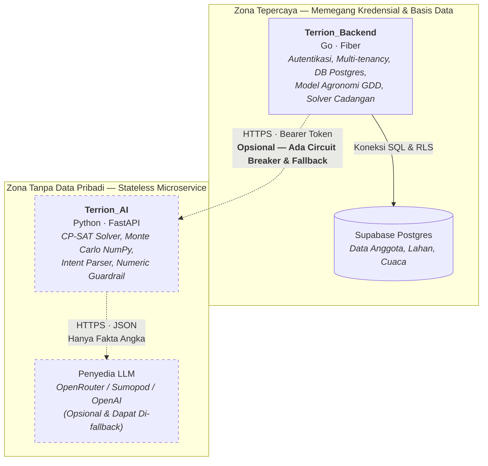
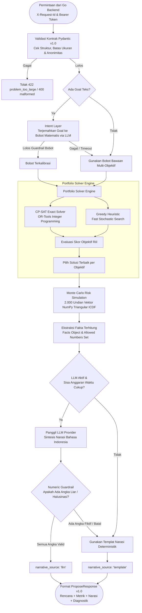

# Terrion_AI

[](https://www.python.org/)
[](https://fastapi.tiangolo.com/)
[](https://developers.google.com/optimization)
[](https://numpy.org/)
[](docs/ARCHITECTURE.md)
[-brightgreen.svg)](tests/)
[](#7-prinsip-ai-bertanggung-jawab--keamanan)
[](LICENSE)

Layanan komputasi kecerdasan buatan dan optimasi perencanaan tanam untuk **Terrion** — sistem pelacakan lahan dan perencanaan musim kolektif untuk koperasi tani. Layanan ini menyelesaikan optimasi kombinatorial multi-objektif, mengukur ketidakpastian risiko cuaca/panen secara probabilistik, menerjemahkan arahan pengurus koperasi dalam bahasa alami, dan menyajikan narasi hasil perencanaan dalam Bahasa Indonesia yang dijamin bebas halusinasi numerik.

> **Layanan ini bersifat opsional (*Soft Dependency*).**  
> Jika layanan ini mati, tidak ter-deploy, atau mengalami batas waktu (*timeout*), fitur perencanaan di Terrion tetap berjalan penuh 100% menggunakan solver cadangan bawaan di dalam `Terrion_Backend` (Go). Yang berubah hanyalah satu *field* status pada respons: `"engine": "fallback"`. Hal ini merupakan prinsip desain nomor satu: **kecerdasan buatan hadir sebagai peningkatan (*enhancement*), bukan titik kegagalan tunggal (*single point of failure*).**

---

## Daftar Isi

- [1. Konteks Masalah & Nilai Bisnis](#1-konteks-masalah--nilai-bisnis)
- [2. Fitur Utama & Keunggulan](#2-fitur-utama--keunggulan)
- [3. Arsitektur Sistem & Alur Data](#3-arsitektur-sistem--alur-data)
- [4. Pipeline Pemrosesan End-to-End](#4-pipeline-pemrosesan-end-to-end)
- [5. Teknologi & Alasan Pemilihan](#5-teknologi--alasan-pemilihan)
- [6. Spesifikasi Kontrak API (v1.0)](#6-spesifikasi-kontrak-api-v10)
- [7. Prinsip AI Bertanggung Jawab & Keamanan](#7-prinsip-ai-bertanggung-jawab--keamanan)
- [8. Panduan Instalasi & Penggunaan Lokal](#8-panduan-instalasi--penggunaan-lokal)
- [9. Konfigurasi Lingkungan (.env)](#9-konfigurasi-lingkungan-env)
- [10. Pengujian & Jaminan Mutu](#10-pengujian--jaminan-mutu)
- [11. Panduan Deployment Produksi](#11-panduan-deployment-produksi)
- [12. Struktur Repositori](#12-struktur-repositori)
- [13. Keterbatasan yang Dinyatakan](#13-keterbatasan-yang-dinyatakan)
- [14. Lisensi](#14-lisensi)

---

## 1. Konteks Masalah & Nilai Bisnis

### Dilema Panen Raya (*The Harvest Glut Dilemma*)
Pada koperasi pertanian tipikal dengan 40–100 lahan anggota, para petani cenderung menanam pada waktu yang hampir bersamaan karena hujan awal musim tiba serentak dan kebiasaan meniru tetangga. 

Akibatnya, 3–4 bulan kemudian terjadi **bencana logistik dan ekonomi**:
1. **Penumpukan Puncak (*Logistics Bottleneck*)**: Seluruh lahan panen di pekan yang sama. Kapasitas lantai jemur, gudang penyimpanan (*storage capacity*), dan armada truk koperasi tidak mencukupi.
2. **Kejatuhan Harga Pasar (*Price Crash*)**: Terjadi banjir pasokan tepat saat semua orang menjual komoditas yang sama, menekan harga jual ke titik terendah.
3. **Kegagalan Kontrak (*Contract Default*)**: Pada pekan-pekan berikutnya koperasi mengalami kekosongan stok, sehingga gagal memenuhi kuota pasokan rutin kepada mitra pembeli (*off-taker*).

```
Pola Tanam Konvensional (Tanpa Terrion):
Tonase Panen
  ▲
  │              ████  <- Puncak panen meluber melebihi kapasitas gudang!
  │             ██████    (Komoditas rusak, truk antre, harga anjlok)
  │            ████████
  │  ── ── ── ┌────────┐ ── ── ── <- Kapasitas Tampung Maksimal Koperasi
  │           │        │
  │           │        │
  │ ░░░░░░░░░ │        │ ░░░░░░░  <- Pekan lain kosong (gagal kontrak pembeli)
  └──────────────────────────────► Waktu (Pekan)

Pola Tanam Terencana (Dengan Terrion_AI):
Tonase Panen
  ▲
  │  ── ── ── ┌────────┐ ── ── ── <- Kapasitas Tampung Maksimal Koperasi
  │  ████████ │████████│ ████████
  │  ████████ │████████│ ████████ <- Terdistribusi rata sepanjang musim:
  │  ████████ │████████│ ████████    gudang aman, kontrak pembeli terpenuhi,
  └──────────────────────────────► Waktu (Pekan)    nilai jual maksimal.
```

### Solusi Terrion
Terrion mengamati seluruh lahan anggota secara agregat. 
- **`Terrion_Backend` (Go)** menghitung ratusan kombinasi *lahan × varietas × tanggal tanam* berdasarkan model agronomi (fenologi GDD dan kalibrasi hasil).
- **`Terrion_AI` (Python)** menerima daftar ratusan kandidat kombinasi tersebut dan menjawab pertanyaan mendasar pengurus koperasi: **"Kombinasi mana yang sebaiknya dipilih untuk setiap lahan agar risiko minim, pendapatan petani optimal, dan kontrak pembeli terpenuhi?"**

---

## 2. Fitur Utama & Keunggulan

| Fitur | Deskripsi Teknis | Manfaat Nyata bagi Koperasi |
| --- | --- | --- |
| **3 Rencana Optimasi (*Pareto Frontier*)** | Menghasilkan 3 rencana alternatif simultan: **Aman** (*risk-averse*), **Pendapatan** (*profit-maximizing*), dan **Pasar** (*contract-fulfilling*). | Pengurus koperasi dan musyawarah tani memiliki opsi komparatif transparan, bukan sekadar keputusan sepihak mesin. |
| **Penskoringan Batas Atas (*P90 Scoring*)** | Rencana "Aman" diskor berdasarkan kuantil persentil ke-90 (kondisi iklim buruk), bukan nilai rata-rata (*expected value*). | Rencana yang hanya aman di musim rata-rata bukanlah rencana aman. Koperasi terlindungi dari lonjakan pasokan tak terduga. |
| **Simulasi Risiko Monte Carlo (NumPy)** | Menjalankan **2.000 iterasi musim simulasi** tervektorisasi dengan distribusi probabilitas segitiga (*triangular ICDF*) per kandidat dalam waktu <30 milidetik. | Mengukur distribusi kuantil puncak panen (P50 dan P90) untuk kepastian kecukupan kapasitas gudang. |
| **Penerjemah Niat (*Intent Layer*)** | Menerjemahkan bahasa alami pengurus (misal: *"fokus hindari penumpukan di awal tahun"*) menjadi vektor bobot matematis yang terikat aturan pembatas (*floor guardrail*). | Pengurus koperasi dapat mengarahkan fokus komputasi tanpa memahami kalkulus bobot numerik. |
| **Penjaga Numerik Ketat (*Strict Numeric Guardrail*)** | Model bahasa menulis narasi penjelas, tetapi setiap token angka diuji terhadap kumpulan fakta terhitung (`Facts.allowed_numbers()`). | **0% toleransi halusinasi numerik**. Jika LLM mengubah angka, membulatkan sepihak, atau mengarang data, teks langsung dibatalkan dan diganti templat deterministik. |
| **Arsitektur Nir-Data-Pribadi (*Zero-PII*)** | Ditegakkan langsung oleh definisi tipe Pydantic dan regex buram `^[pkv][0-9]+$`. | Data anggota, NIK, nama petani, koordinat GPS, dan nama desa tidak pernah meninggalkan backend Go. |
| **Determinisme Penuh** | Menggunakan generator angka acak teregistrasi (`seed`). Permintaan identik dengan *seed* identik menghasilkan rencana 100% konsisten. | Hasil komputasi dapat diaudit ulang kapan saja (*reproducible & auditable*). |

---

## 3. Arsitektur Sistem & Alur Data

Terrion memisahkan sistem menjadi dua zona keamanan dan tanggung jawab yang tegas:



### Pembagian Tanggung Jawab Antar-Layanan

| Lapis | Komponen | Lokasi | Alasan Desain |
| --- | --- | --- | --- |
| **L1 — Agronomi & Entitas** | Kalibrasi GDD, akumulasi suhu, model hasil panen *ridge*, batas lahan fisik. | `Terrion_Backend` (Go) | Terikat langsung pada tabel database dan histori cuaca. Menjaga satu sumber kebenaran data agronomi. |
| **L2 — Solver & Risiko** | Pemecahan optimasi kombinatorial 3 objektif, propagasi ketidakpastian panen. | `Terrion_AI` (Python) | Masalah Riset Operasi (*Operations Research*) murni. Memanfaatkan ekosistem matang Google OR-Tools CP-SAT dan komputasi matriks NumPy. |
| **L3 — Agen & Bahasa** | Penerjemahan niat arahan pengurus, sintesis narasi Bahasa Indonesia, validasi numerik. | `Terrion_AI` (Python) | LLM client, guardrails teks, prompt management, dan evaluasi format lebih cepat dan aman dijalankan di luar zona database. |

> **Yang Terrion_AI TIDAK miliki dan TIDAK BOLEH miliki:**  
> Koneksi database, kredensial Supabase/PostgreSQL, nama anggota/petani, NIK, koordinat polygon lahan, nama desa/kecamatan, dan status (*state*) antar-permintaan.

---

## 4. Pipeline Pemrosesan End-to-End

Setiap panggilan ke endpoint utama `/v1/plan/propose` melewati alur sekuensial yang terukur anggaran waktunya:



### Detail Tahapan Kritis:
1. **Pemanasan Sistem (*Lifespan Warm-up*)**:
   - Impor mesin CP-SAT dilakukan di *thread* latar belakang saat proses *booting* untuk menghemat latensi 549 ms dari permintaan pengguna pertama.
   - Klien HTTP melakukan *pre-warming* koneksi TLS ke penyedia LLM (menghemat latensi *handshake* awal ~1,4 detik).
2. **Hybrid Solver Portfolio**:
   - Menjalankan CP-SAT untuk mencari solusi optimal global matematis.
   - Secara bersamaan menjalankan algoritma heuristik *Greedy* (<10 ms).
   - Pada rencana "Aman", metrik non-linear P90 hasil Monte Carlo diuji langsung terhadap keluaran kedua solver. Solusi dengan skor empiris terbaik yang dipilih (menghindari kelemahan aproksimasi linier).
3. **Pengendalian Anggaran Waktu Dinamis (*Time-Budgeting*)**:
   - Backend Go menetapkan batas waktu total 3.500 ms.
   - Terrion_AI menghitung waktu yang telah dihabiskan oleh *intent layer* dan *solver*, lalu mengalokasikan sisa waktu murni untuk *narration layer*. Jika sisa waktu tidak mencukupi, narasi otomatis beralih ke templat tanpa memicu *timeout*.

---

## 5. Teknologi & Alasan Pemilihan

| Pustaka / Alat | Peran dalam Sistem | Alasan Pemilihan Teknis |
| --- | --- | --- |
| **`fastapi`** | Kerangka kerja web ASGI HTTP | Skema Pydantic berperan langsung sebagai kontrak API tunggal (*single source of truth*), dokumentasi otomatis OpenAPI/Swagger. |
| **`uvicorn[standard]`** | Server ASGI produksi | Ringan, kompatibel penuh dengan arsitektur *event-loop* Python, ideal untuk kontainer *stateless*. |
| **`pydantic` (v2)** | Validasi payload kontrak v1.0 | Kecepatan validasi berbasis Rust core, penegakan aturan batas ukuran, serta isolasi data non-pribadi lewat `ConfigDict(extra="ignore", frozen=True)`. |
| **`pydantic-settings`** | Manajemen konfigurasi dari `.env` | Tipe data kuat untuk variabel lingkungan dengan nilai bawaan aman (*safe defaults*). |
| **`ortools` (CP-SAT)** | Solver pemrograman kendala (*Constraint Programming*) | Solver industri terbaik untuk masalah optimasi kombinatorial diskret dan penjadwalan tanpa memerlukan lisensi komersial mahal. |
| **`numpy`** | Simulasi Monte Carlo | Operasi matriks tervektorisasi berbasis C. Menjalankan 2.000 iterasi musim untuk 3 rencana dalam waktu ~20 ms (loop Python murni memakan puluhan detik). |
| **`httpx`** | Klien HTTP asinkron ke penyedia LLM | Mendukung asynchronous I/O dengan *connection pooling* persisten (`keepalive_expiry=None`) dan batas waktu presisi per panggilan. |
| **`structlog`** | *Structured JSON Logging* | Menyertakan `request_id` dari Go backend pada setiap baris log JSON, memungkinkan pelacakan jejak lintas layanan (*distributed tracing*). |
| **`pytest` & `pytest-asyncio`** | Framework pengujian otomatis | Mendukung pengujian unit, asinkron, determinisme, dan kepatuhan kontrak JSON emas. |
| **`ruff`** | Linter & formatter kode | Eksekusi super cepat untuk menjaga standar kualitas kode PEP 8 dan Python 3.12+. |

### Yang Sengaja Dihindari (*Intentional Non-Usage*):
- **Tanpa Pandas**: Tidak ada manipulasi tabel atau operasi *merge/join* relasional. Menghindari beban ~50 MB pada ukuran citra Docker.
- **Tanpa PyTorch / Scikit-Learn**: Tidak ada model yang dilatih atau di-*fine-tune* pada runtime ini. Model agronomi berada di Go. Menambahkan dependensi *deep learning* ratusan megabyte hanya untuk komputasi optimasi adalah inefisiensi arsitektur.
- **Tanpa LangChain / LlamaIndex**: Arsitektur hanya membutuhkan satu prompt terstruktur dengan validasi ketat. Abstraksi rantai berlapis hanya menambah *overhead* latensi dan memperbesar permukaan galat.
- **Tanpa Celery / Redis**: Layanan ini bersifat sinkron cepat (<2 detik) dan murni *stateless*. Manajemen antrean dan *cache* hasil ditangani langsung di sisi Go backend.

---

## 6. Spesifikasi Kontrak API (v1.0)

Kontrak data antara `Terrion_Backend` (Go) dan `Terrion_AI` (Python) dibekukan pada versi **`v1.0`**. 

Keduanya disinkronkan tanpa monorepo dan tanpa kode generator eksternal, melainkan menggunakan **berkas emas JSON kembar (*Twin Golden JSON Fixtures*)**:
- Sisi Python: `tests/fixtures/propose_request.golden.json`
- Sisi Go: `internal/aiclient/testdata/propose_request.golden.json`

### 1. Endpoint Utama: `POST /v1/plan/propose`

Menyelesaikan persoalan perencanaan tanam multi-lahan dan menghasilkan tiga rencana komparatif.

#### Header Wajib:
- `Authorization: Bearer <AI_SERVICE_TOKEN>`
- `Content-Type: application/json`
- `X-Request-Id: <UUID>` *(opsional, dianjurkan untuk tracing)*

#### Batasan Payload Permintaan:
- `candidates`: Maksimal 2.000 item.
- `demand`: Maksimal 400 baris.
- `objectives`: 1 hingga 3 opsi (`"aman"`, `"pendapatan"`, `"pasar"`).
- `goal`: Maksimal 500 karakter teks bebas pengurus koperasi.

#### Contoh Cuplikan Permintaan (Request):
```json
{
  "contract_version": "1.0",
  "request_id": "5a1f0c9e-3c2a-4b3e-9f5a-77c0e2b1d004",
  "seed": 20260905,
  "season": {
    "label": "MT I 2026/2027",
    "start": "2026-10-01",
    "end": "2027-03-31"
  },
  "objectives": ["aman", "pendapatan", "pasar"],
  "goal": "Prioritaskan panen tidak menumpuk di gudang pada awal tahun baru",
  "capacity_tonnes_per_week": 12.5,
  "candidates": [
    {
      "id": "c001",
      "plot_ref": "p1",
      "area_ha": 0.82,
      "commodity_ref": "k1",
      "variety_ref": "v1",
      "planting_date": "2026-10-05",
      "harvest_start": "2027-01-08",
      "harvest_end": "2027-01-22",
      "tonnes_low": 3.72,
      "tonnes_mid": 4.59,
      "tonnes_high": 5.65,
      "plausibility": "plausible",
      "price_per_kg": 5200.0
    }
  ],
  "demand": [
    {
      "commodity_ref": "k1",
      "iso_week": "2027-01-11",
      "kg": 3000
    }
  ]
}
```

#### Contoh Cuplikan Respons (Response 200 OK):
```json
{
  "contract_version": "1.0",
  "request_id": "5a1f0c9e-3c2a-4b3e-9f5a-77c0e2b1d004",
  "solver": "cp-sat",
  "solver_version": "1.0.0",
  "elapsed_ms": 1420,
  "plans": [
    {
      "objective": "aman",
      "candidate_ids": ["c004", "c007", "c014", "c020", "c022"],
      "metrics": {
        "peak_tonnes_p50": 7.65,
        "peak_tonnes_p90": 8.58,
        "total_tonnes": 24.77,
        "gross_value": 254147000.0,
        "demand_covered_kg": 5613
      },
      "narrative": "Rencana ini disusun agar panen tidak menumpuk di satu minggu. Sebanyak 5 lahan ditanami dengan 5 varietas, sehingga panen tersebar di 12 minggu, dari pekan 2026-12-14 sampai pekan 2027-03-01. Dari perkiraan total 24,8 ton, puncak panen mingguan berada di sekitar 7,7 ton, dan sembilan dari sepuluh musim tetap di bawah 8,6 ton. Kapasitas tampung koperasi adalah 12,5 ton per minggu. Rencana ini menutup 5.613 kg permintaan pembeli. Angka di atas adalah proyeksi, bukan kepastian.",
      "narrative_source": "template"
    }
  ],
  "diagnostics": {
    "evaluations": 142,
    "monte_carlo_draws": 2000,
    "objective_status": "OPTIMAL",
    "degraded": []
  }
}
```

### 2. Endpoint Operasional & Pemantauan

| Metode | Jalur | Kegunaan | Deskripsi Respon |
| --- | --- | --- | --- |
| `GET` | `/health` | *Liveness Probe* | Cek proses aktif. Mengembalikan `{"status": "ok", "service": "terrion-ai"}`. |
| `GET` | `/ready` | *Readiness Probe* | Memastikan modul CP-SAT siap, versi kontrak sesuai, dan konfigurasi LLM terbaca. |
| `GET` | `/docs` | OpenAPI UI | Dokumentasi interaktif Swagger API. |

### 3. Penanganan Galat & Standar Amplop Kesalahan

Setiap respons kesalahan mengembalikan format JSON standar:
```json
{
  "error": {
    "code": "<kode_galat>",
    "message": "<pesan_detail>"
  }
}
```

| Kode HTTP | Kode Galat (`code`) | Penyebab & Tanggapan Sistem |
| --- | --- | --- |
| `400` | `malformed_request` | Sintaks JSON cacat atau field wajib tidak ada. Pesan menyebut nama field yang bermasalah. |
| `401` | `unauthenticated` | Token pada header `Authorization` kosong atau tidak cocok dengan `AI_SERVICE_TOKEN`. |
| `409` | `contract_version_unsupported` | Versi major kontrak tidak kompatibel (misal: pengirim `2.0`, penerima `1.0`). Sisi Go otomatis fallback ke solver lokal. |
| `422` | `problem_too_large` | Melebihi batas ukuran (kandidat > 2000, demand > 400). Pesan menyebutkan field dan kuota spesifiknya. |
| `500` | `solver_failed` | Kesalahan internal solver saat melakukan pencarian solusi. |

---

## 7. Prinsip AI Bertanggung Jawab & Keamanan

### 1. Batas Nol-Data-Pribadi (*Zero-PII by Type Design*)
Data pribadi tidak disaring menggunakan *regex* atau filter teks manual, melainkan **dieliminasi dari struktur data sejak awal**:
- Tipe `Candidate` sama sekali tidak menyediakan field untuk nama petani, NIK, koordinat geospasial, atau nama desa.
- Referensi entitas hanya berupa ID buram per-permintaan (misal: `p1`, `v2`, `c010`). Kode regex `^[pkv][0-9]+$` menolak UUID asli atau teks beracun dengan galat `422`.
- Blok fakta yang dikirim ke LLM pihak ketiga bahkan tidak memuat referensi lahan buram tersebut — pihak luar hanya menerima agregat angka matematis.

### 2. Penjaga Numerik Anti-Halusinasi (*Strict Numeric Guardrail*)
LLM adalah penyusun kata, bukan mesin kalkulator. Penerapan guardrail pada `app/agent/guard.py`:
- Model bahasa dilarang menghitung atau menyimpulkan angka sendiri.
- Setiap token angka yang ditulis oleh model diekstrak dan dicocokkan dengan himpunan angka sah `Facts.allowed_numbers()`.
- Jika ditemukan satu angka yang tidak terdaftar (hasil halusinasi atau pembulatan yang tidak akurat), seluruh paragraf LLM dibuang dan diganti dengan templat berbasis aturan (*rule-based template*). Field status mencatat degradasi: `narrative_source: "template"`.

### 3. Batas Niat Bahasa Alami (*Intent Floor Guardrail*)
Pada `app/agent/intent.py`, penerjemahan bahasa alami hanya diizinkan menggeser bobot relatif optimasi antara $0$ dan $1$.
- Diberlakukan batas bawah (*floor*): $w_{\text{dominant}} \ge 0,35$.
- Hal ini menjamin bahwa rencana berlabel "Aman" tidak dapat dimanipulasi oleh *prompt injection* untuk menjadi rencana pengejar laba berisiko tinggi. Label di antarmuka pengguna tidak akan pernah membohongi pengurus koperasi.

---

## 8. Panduan Instalasi & Penggunaan Lokal

### Prasyarat Sistem
- **Python 3.12** atau versi yang lebih baru.
- Manajer paket `pip`.
- Sistem Operasi: Linux, macOS, atau Windows (mendukung penuh lingkungan PowerShell).

### Langkah Instalasi

```bash
# 1. Klon repositori
git clone https://github.com/ITechnoCup2026/Terrion_AI.git
cd Terrion_AI

# 2. Buat dan aktifkan virtual environment
# Linux/macOS:
python3 -m venv .venv && source .venv/bin/activate
# Windows (PowerShell):
python -m venv .venv
.\.venv\Scripts\Activate.ps1

# 3. Pasang dependensi lengkap (termasuk solver CP-SAT dan alat pengujian)
pip install -e ".[dev]"

# 4. Salin template konfigurasi lingkungan
cp .env.example .env
```

### Menjalankan Server Lokal

```bash
# Menjalankan server pengembangan dengan auto-reload
uvicorn app.main:app --reload --port 8080
```
Server akan aktif di `http://localhost:8080`. Dokumentasi interaktif Swagger dapat diakses di `http://localhost:8080/docs`.

### Uji Coba Cepat dengan Fixture Golden (cURL)

Jalankan perintah berikut untuk menguji kalkulasi lengkap dengan data uji resmi:

```bash
curl -s -X POST http://localhost:8080/v1/plan/propose \
  -H "Authorization: Bearer lokal-dev-token" \
  -H "Content-Type: application/json" \
  -d @tests/fixtures/propose_request.golden.json | python -m json.tool
```

---

## 9. Konfigurasi Lingkungan (.env)

Layanan dapat berjalan penuh secara luring (*offline*) tanpa memerlukan kunci API eksternal apa pun saat menggunakan `LLM_PROVIDER=template`.

| Variabel Lingkungan | Nilai Bawaan (*Default*) | Keterangan & Rekomendasi |
| --- | --- | --- |
| `AI_SERVICE_TOKEN` | *(Wajib Diisi)* | Kunci rahasia bersama (*shared secret*) untuk autentikasi Bearer token dari backend Go. Nilai harus identik di kedua sisi. |
| `LLM_PROVIDER` | `template` | Opsi: `template`, `sumopod`, `openrouter`, `openai`. Nilai `template` berjalan 100% lokal dan deterministik tanpa jaringan. |
| `LLM_API_KEY` | *(Kosong)* | Kunci API penyedia LLM. Biarkan kosong jika memakai `template`. |
| `LLM_BASE_URL` | `https://ai.sumopod.com/v1` | URL basis endpoint yang kompatibel dengan protokol OpenAI `/chat/completions`. |
| `LLM_MODEL` | `gpt-5.4-nano` | Model target narasi. Telah dievaluasi memiliki akurasi numerik dan kecepatan terbaik di bawah anggaran batas waktu. |
| `LLM_FALLBACK_MODELS` | *(Kosong)* | Daftar model cadangan khusus untuk OpenRouter (dipisahkan koma). |
| `LLM_TIMEOUT_MS` | `2800` | Batas anggaran waktu narasi LLM (milidetik). Menjaga total pemrosesan di bawah timeout Go (3.500 ms). |
| `LLM_MAX_TOKENS` | `400` | Alokasi maksimal token respon LLM (termasuk parameter `reasoning: {enabled: false}`). |
| `SOLVER_TIME_LIMIT_MS` | `1000` | Batas waktu komputasi CP-SAT per objektif dalam milidetik. |
| `MONTE_CARLO_DRAWS` | `2000` | Jumlah iterasi musim simulasi probabilistik untuk kalkulasi kuantil P50/P90. |
| `LOG_LEVEL` | `INFO` | Tingkat rincian log (`DEBUG`, `INFO`, `WARNING`, `ERROR`). Log diformat terstruktur sebagai JSON. |

---

## 10. Pengujian & Jaminan Mutu

Suite pengujian mencakup **84 pengujian otomatis** yang memvalidasi setiap invarian matematika, kepatuhan kontrak, dan keamanan privasi.

```bash
# Menjalankan seluruh pengujian
pytest -v

# Menjalankan linter kode
ruff check .
```

### Cakupan Pengujian

```
collected 84 items

tests/test_contract_golden.py ......   Kesesuaian kontrak terhadap fixture bersama Go backend
tests/test_cpsat.py ................   Ketepatan solusi CP-SAT, batasan kapasitas, dan optimality
tests/test_endpoint.py .............   Validasi HTTP, error code 400/401/409/422, dan invariant dominasi
tests/test_guard.py ................   Penjaga numerik, deteksi angka halusinasi, teks terpotong
tests/test_intent.py ...............   Penerjemah niat bahasa alami, normalisasi, dan penegakan batas floor
tests/test_llm_budget.py ...........   Pengendalian batas waktu dan pemangkasan token
tests/test_metrics.py ..............   Perhitungan metrik tonase, gross revenue, dan pemenuhan kontrak
tests/test_narration.py ............   Sintesis templat bahasa Indonesia dan penanganan API key salah
tests/test_no_personal_data.py .....   Jaminan ketiadaan data pribadi (Zero-PII) & penolakan format UUID
tests/test_solver_determinism.py ...   Jaminan determinisme hasil kalkulasi dengan seed yang sama

============================== 84 passed in ~7.9s ==============================
```

---

## 11. Panduan Deployment Produksi

### 1. Deployment ke Railway
Repositori telah dilengkapi konfigurasi otomatis via `railway.json` dan `Dockerfile`:

```bash
# Login dan inisialisasi
npm i -g @railway/cli
railway login
railway init
railway up

# Atur variabel lingkungan produksi (jangan set PORT secara manual)
railway variables \
  --set AI_SERVICE_TOKEN="<token_rahasia_produksi>" \
  --set LLM_PROVIDER="template" \
  --set LOG_LEVEL="INFO"

# Dapatkan domain publik
railway domain
```

### 2. Deployment ke Fly.io
Tersedia konfigurasi `fly.toml` siap pakai (wilayah Singapura `sin`, 512 MB memory, auto-stop saat menganggur):

```bash
fly launch --copy-config --no-deploy
fly secrets set AI_SERVICE_TOKEN="<token_rahasia_produksi>"
fly deploy
```

### 3. Container Docker Mandiri

```bash
# Build citra Docker
docker build -t terrion-ai:1.0.0 .

# Jalankan kontainer
docker run -d \
  -p 8080:8080 \
  -e AI_SERVICE_TOKEN="rahasia123" \
  -e LLM_PROVIDER="template" \
  --name terrion-ai-service \
  terrion-ai:1.0.0
```

---

## 12. Struktur Repositori

```
Terrion_AI/
├── app/
│   ├── agent/                      # Lapis Agen, Pemahaman Niat & Narasi
│   │   ├── prompts/
│   │   │   └── narrate_id.txt      # Berkas aset prompt bahasa Indonesia
│   │   ├── explain.py              # Orkestrasi narasi paralel beranggaran waktu
│   │   ├── facts.py                # Ekstraksi blok fakta & himpunan angka terhitung
│   │   ├── guard.py                # Penjaga numerik ketat anti-halusinasi
│   │   ├── intent.py               # Penerjemah bahasa alami ke bobot optimasi
│   │   └── providers.py            # Klien LLM (Template, OpenRouter, Sumopod, OpenAI)
│   ├── contracts/                  # Definisi Kontrak & Skema Data
│   │   └── v1.py                   # Kontrak v1.0 Pydantic (Permintaan, Respon, Metrik)
│   ├── risk/                       # Lapis Risiko & Ketidakpastian
│   │   └── montecarlo.py           # Simulasi Monte Carlo 2.000 iterasi tervektorisasi NumPy
│   ├── solver/                     # Mesin Optimasi Kombinatorial
│   │   ├── cpsat.py                # Solver CP-SAT Google OR-Tools
│   │   ├── greedy.py               # Solver Heuristik Cepat (Greedy Baseline)
│   │   ├── metrics.py              # Kalkulasi metrik kuantitatif rencana
│   │   ├── objectives.py           # Formulasi skalarisasi 3 fungsi objektif
│   │   └── errors.py               # Definisi galat spesifik solver
│   ├── config.py                   # Konfigurasi sistem Pydantic Settings
│   ├── logging.py                  # Format log JSON terstruktur (Structlog)
│   ├── main.py                     # Aplikasi FastAPI & handler endpoint (/propose, /health)
│   ├── problem.py                  # Representasi domain persoalan optimasi
│   └── security.py                 # Validasi autentikasi Bearer Token
├── docs/                           # Dokumentasi Mendalam & Diagram
│   ├── ARCHITECTURE.md             # Dokumen arsitektur lengkap, kontrak v1.0, dan 10 ADR
│   ├── INTEGRASI_FRONTEND.md       # Panduan integrasi tampilan antarmuka
│   ├── RENCANA_AI_SERVICE_PYTHON.md # Rencana awal rekayasa sistem AI
│   ├── terrion_ai_architecture_pipeline.svg # Diagram vektor pipeline pemrosesan
│   └── terrion_ai_architecture_simple.svg   # Diagram arsitektur zona kepercayaan
├── tests/                          # Rangkaian Pengujian Otomatis (84 Uji)
│   ├── fixtures/                   # Fixture JSON emas sinkronisasi lintas repo
│   │   ├── propose_request.golden.json
│   │   └── propose_response.golden.json
│   ├── conftest.py                 # Fixture pytest bersama & mocking
│   ├── test_contract_golden.py
│   ├── test_cpsat.py
│   ├── test_endpoint.py
│   ├── test_guard.py
│   ├── test_intent.py
│   ├── test_llm_budget.py
│   ├── test_metrics.py
│   ├── test_narration.py
│   ├── test_no_personal_data.py
│   └── test_solver_determinism.py
├── .env.example                    # Template konfigurasi variabel lingkungan
├── Dockerfile                      # Spesifikasi kontainer produksi
├── fly.toml                        # Konfigurasi penyebaran Fly.io
├── pyproject.toml                  # Metadata proyek, dependensi, dan konfigurasi tool
├── railway.json                    # Konfigurasi penyebaran Railway
└── README.md                       # Dokumentasi utama proyek
```

---

## 13. Keterbatasan yang Dinyatakan

Sebagai bentuk integritas rekayasa (*engineering integrity*), terdapat tiga batasan yang dinyatakan secara terbuka:

1. **Harga Acuan Masih Bersifat Sintetis**:  
   Panel harga acuan komoditas di basis data saat ini dibangkitkan dari simulasi gelombang musiman pada data *seed*. Algoritma optimasi telah berfungsi penuh dan langsung menghasilkan nilai riil begitu data harga historis pasar dimasukkan ke dalam sistem. Nilai estimasi pendapatan saat ini ditujukan untuk pemeringkatan komparatif, bukan nominal rupiah pasti.
2. **Independensi Cuaca Antar-Lahan pada Monte Carlo**:  
   Simulasi Monte Carlo saat ini mengasumsikan undian distribusi waktu panen antar-lahan bersifat independen. Pada kondisi nyata, fenomena iklim ekstrem (seperti El Niño/La Niña) mempengaruhi kawasan secara terkorelasi. Peningkatan faktor korelasi spasial iklim telah dijadwalkan pada roadmap versi 2.0.
3. **Pemeriksaan Digit Angka pada Penjaga Numerik**:  
   Penjaga numerik memvalidasi representasi token digit angka (misal: `"12"`, `"8,5"`, `"5.000"`). Penjaga tidak memeriksa angka yang dieja menggunakan kata huruf (misal: *"dua belas"*). Hal ini diatasi melalui instruksi sistem pada prompt yang secara eksplisit melarang model menuliskan kuantitas dalam bentuk ejaan kata.

---

## 14. Lisensi

Hak Cipta © 2026 **Tim Terrion** (Kompetisi ITechnoCup 2026).  
Didistribusikan di bawah lisensi terbuka [MIT License](LICENSE).
